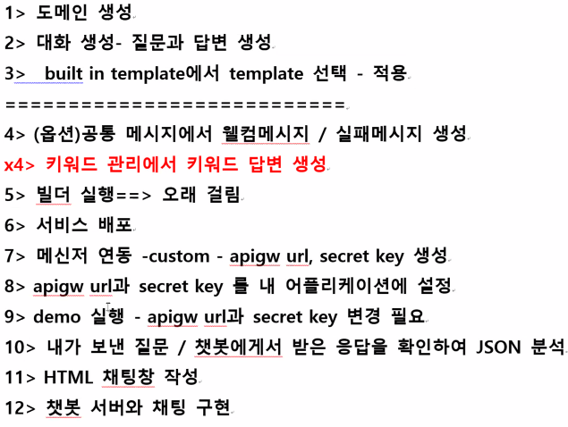

# CLOVA Chatbot

Console -> Products & Services -> CLOVA Chatbot -> Domain -> 도메인 생성 

-> 적당한 도메인명 , 도메인 코드, 자연어처리 : 한국어, 서브스타입 : Basic, 대화 로그 임시 저장 : 저장

-> 대화목록

[챗봇가이드](https://guide.ncloud-docs.com/docs/ko/chatbot-chatbot-1-1)

 APIGW Invoke URL

https://1f5fe6b9abc34e30b127598391e922f9.apigw.ntruss.com/custom/v1/4662/cf5c162b532afd12ff26ca100346306baffd431e784fec724e6a3d3faa151fe7

Sekret Key

ckxrdUpiQW5Gb1hzUUZ4bEp5TWZQQ1JvS0lwS3FIeHc=