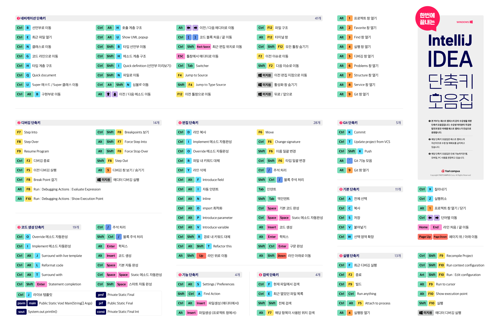

# InteliJ 단축키

 

### Alt+1 : 프로젝트창 포커스

프로젝트창이 포커스된경우 space로 프로젝트 코드를 미리볼 수 있다

### ESC : 에디터창으로 돌아오기

 

### Ctrl + Shift + F12 : 에디터창만 보기

한번 더 입력하면 다시 돌아간다

 

### ctrl + tab : 에디터창 항목선택

### ctrl + alt + Insert : 클래스파일 생성 (에디터창 포커스)

### alt + Insert : 클래스파일 생성 (프로젝트창 포커스)

 

### ctrl + w : 선택영역 확장

### ctrl + shift + w : 선택영역 축소

 

### ctrl + / : 한 줄 주석

### shift + ctrl + / : 블록주석

 

### ctrl + alt + i : 코드 자동정렬

전체영역 선택한 후 적용해보자

 

### ctrl + f : 파일검색

### ctrl + shift + f : 전체 검색

### shift 두번 : inteliJ 기능검색

### ctrl + e : 최근파일 검색

 

