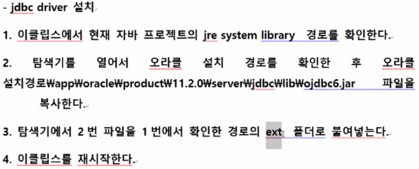

## JDBC driver설치

 

## JDBC 작성순서

1. **jdbc driver(자바클래스) 등록 메모리 로드**

   Class.forName("oracle.jdbc.driver.OracleDriver"); // jdbc드라이버인식 

2. **db연결**

   con = DriverManager.getConnection("jdbc:oracle:thin:@127.0.0.1:1521:xe", "jdbc", "jdbc"); // db연결

3. **sql 전송**

   String insertSQL = "insert into employees values(?, ?, ?, ?)"

   st.setInt(1, 800); 

   st.setString(2, "김신입"); 

   st.setString(3, "사원"); 

   st.setDouble(4, 10000.99);

   pt = con.prepareStatement(insertSQL);

   —> sql문을 prepareStatement 방식으로  전송하겠다

 

## JDBC함수정리

### ResultSet

ResultSet rs = null; —> ResultSet은 DB를 조회할때 사용한다

String SQL = "select ~~~" // 조회할 SQL문 작성

rs = pt.executeQuery(SQL); // DB에 접근할 수 있는 객체를 rs에게 반환

while(rs.next()) { // rs.next로 첫번째행 조회가능

rs.getXXXX()

};

 

### excuteQuery(String sql)

select구문을 실행하기 위한 메소드이다

Statement st = con.createStatement();

rs = pt.executeQuery(); // DB에 접근할 수 있는 객체를 rs에게 반환

ResultSet rs = st.executeQuery("select~~"); //조회된 객체를 rs에 반환하여 사용하기

 

### excuteUpdate(String sql)

insert, delete, update를 실행하기위한 메소드이다

String sql = "insert into c_emp values(600, '이자바', '임원', 10000, 10)";

Statement st = conn.createStatement();

int insertrow = st.executeUpdate(sql);