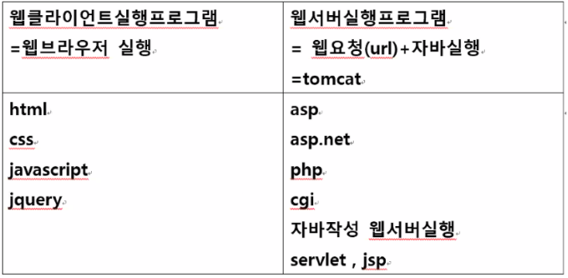

# Servlet

servlet이란 자바코드로 웹을 만들어주는 기술을 말한다

서블릿은 메인이 따로 없는게 특징이고 자바클래스 생성시 

superclass를 아래와같이 설정해줘야한다

**javax.servlet.http.HttpServlet**

<br>



컨테이너는 서버와 같은의미로 해석하면된다

컨테이너 = 웹서버 = tomcat

<br>

## 서블릿 프로그래밍

class A extends HttpServlet --> http 요청 특화 처리 doGet/doPost 선택적 오버라이딩

 class B extends GenericServlet --> Servlet 메소드 일부 구현/ 나머지 오버라이딩 

class C implements Servlet ---> 5개 메소드 모두 오버라이딩

<br>

### 서블릿 실행과정

1. 클라이언트는 브라우저에서 http:/ip:port/프로젝트명/서블릿url 요청
2. 서버는 웹서버가 웹어플리케이션 서버로 위임한다
3. 위임받은 웹어플리케이션 서버가 서블릿 객체 메모리 로딩한다(메모리에 서블릿객체가 로딩되어있지 않을경우)
4. 서블릿 객체 멀티스레드 실행한다.
5. init 호출한다
6. doGet 호출하여 응답한다.
7. 두번째 클라이언트에서 서버에 서블릿요청
8. 서버는 웹서버가 웹어플리케이션 서버로 위임한다.
9. doGet 호출하여 응답한다.
10. 서버 종료나 서블릿 소스파일 변경으로인한 재컴파일 → 서블릿 객체 메모리 삭제
11. destroy() 호출 → init 변수 메모리 삭제

<br>

### GET / POST

클라이언트가 서버에게 데이터를 요청하는 방식에는 GET방식과 POST방식이 있다

GET방식은 URL에 데이터가 담겨있고 데이터길이는 최대 250자까지만 가능하다

<br>

POST방식은 URL에 데이터가 보이지않아 보안에 강하고 데이터길이에 제한을 받지 않는다
하지만 전송속도가 GET방식에 비해 상대적으로 느리다

<br>

### 서블릿 메소드

**doPost** - post요청을 처리하는 메소드

**doGet** - get요청을 처리하는 메소드

<br>

### get과 post를 동시에 처리하는법

방법1

doPost와 doGet메소드를 둘 다 작성한다

```java
protected void doPost(HttpServletRequest request, HttpServletResponse response) 	throws ServletException, IOException {		
    request.setCharacterEncoding("utf-8");
    login(request, response);
}

protected void doGet(HttpServletRequest request, HttpServletResponse response) 		throws ServletException, IOException {		
    request.setCharacterEncoding("utf-8");
    login(request, response);
}

private void login(HttpServletRequest request, HttpServletResponse response) throws 	IOException{
    //공통된부분	
}
```

방법2

service메소드를 사용한다

```java
@Override
protected void service(HttpServletRequest req, HttpServletResponse resp) throws 	ServletException, IOException {
    if(req.getMethod().equals("POST")) {
        //POST방식일때 처리할 코드
    }
    else if(req.getMethod().equals("GET")) {
        //GET방식일때 처리할 코드
    }
}
```

<br>

### DataSource

DB커넥션을 여러개 생성하면 메모리낭비가 심각하다

이는 커넥션풀링을 사용하면 보다 유연하게 관리할 수 있다

**ConnectionPooling**: 다양한 DB에 연결할 수 있는 커넥션을 배열로 관리함

<br>

**톰캣의 DataSource 설정 및 사용방법**

아래와같이 DB커넥션을 생성하면 메모리낭비가 심하다

내 컴퓨터 메모리성능으로는 76번까지 출력된다

```java
try {
    Class.forName("oracle.jdbc.driver.OracleDriver");
    for(int i = 1; i<=100; i++) {
        Connection con = DriverManager.getConnection("jdbc:oracle:thin:@127.0.0.1:1521:xe", "jdbc", "jdbc");
        System.out.println(i + " 번째 연결 생성 - "+con);
        con.close(); // db연결 해제. 메모리 삭제 con표시, 나중에 모아서 일괄삭제
    }
```

따라서 커넥션을 재사용하도록 하자

Server → server.xml → 150~번줄 Context ~ path = servlettest (커넥션풀링 해줄 자바프로젝트) → 아래의 DB커넥션 정보코드 끼워넣기

```jsx
<Context ~~~~>
<Resource 
	      name="jdbc/myoracle" 
	      MaxActive="5" 
	      auth="Container" 
	      maxIdle="5" 
	      maxWait="-1" 
	      type="javax.sql.DataSource" 
	      
	      driverClassName="oracle.jdbc.driver.OracleDriver" 
	      password="jdbc" 
	      url="jdbc:oracle:thin:@127.0.0.1:1521:xe" 
	      username="jdbc"/>
</Context></Host>
```

이제 100번까지 커넥션이 잘되는것을 확인할 수 있다

```java
//1. context = 현재의 dynamic web project
//servlettest 관련설정 가능
Context initContext = new InitialContext();//현재작업다이나믹웹 프로젝트  찾아와
Context envContext = (Context)initContext.lookup("java:/comp/env");
//2. server.xml 설정 찾아와
//3. name=jdbc/myoracle 설정 객체 읽어와라
//ds = connectionpool 객체 
DataSource ds = (DataSource)envContext.lookup("jdbc/myoracle"); 
//name="jdbc/myoracle 찾아와	
			
for(int i=0; i<=100; i++) {
    Connection con = ds.getConnection();
    System.out.println(i+" 번째 연결 생성= "+con);
    con.close();
}
```

<br>

### 서블릿 요청 분산처리

## RequestDispatcher

클라이언트 → 서버로 요청 → 1개의 요청을 서버에서 나눠처리하는방법

```java
@WebServlet("/forward1")
public class Forward1Servlet extends HttpServlet {	

	protected void doGet(HttpServletRequest request, HttpServletResponse response) throws ServletException, IOException {
		String id = request.getParameter("id");
		response.setContentType("text/html;charset=utf-8");
		response.getWriter().println("<h1>(forward1)로그인아이디="+id+"</h1>");
		
		//forward2에 객체를 전달하는방법 "board"는 객체의 이름
		request.setAttribute("board", dto);

		//forward2와 공유
		RequestDispatcher dis = request.getRequestDispatcher("forward2");
		dis.forward(request, response);
		//forward시에는 이전 응답 출력 저장 삭제 - 이동
	}

}
```

forward2가 최종출력된다

```java
@WebServlet("/forward2")
public class Forward2Servlet extends HttpServlet {	

	protected void doGet(HttpServletRequest request, HttpServletResponse response) throws ServletException, IOException {
		String id = request.getParameter("id");
		response.setContentType("text/html;charset=utf-8");
		response.getWriter().println("<h1>(forward2)로그인아이디="+id+"</h1>");

		BoardDTO dto = (BoardDTO)request.getAttribute("board");
		response.getWriter().println("<h1>"+dto.getTitle()+":"+dto.getContents()+"</h1>");
	}

}
```

클라이언트는 forward1이 실행되는줄 알지만 - why?  -> URL상에 forward1이 표시되기때문

사실상 서버에서는 forward2를 실행하고 있다는것!

setAttribute와 getAttribute로 객체를 전달할 수 있다

