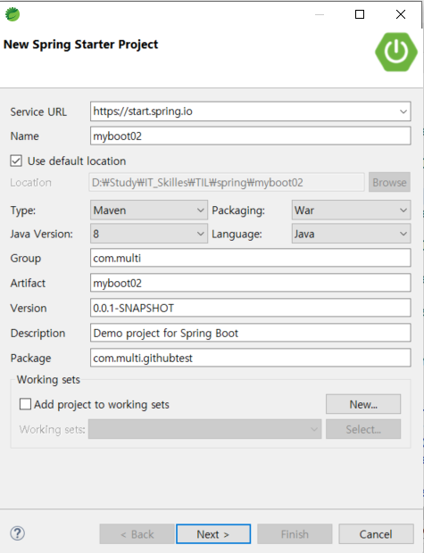
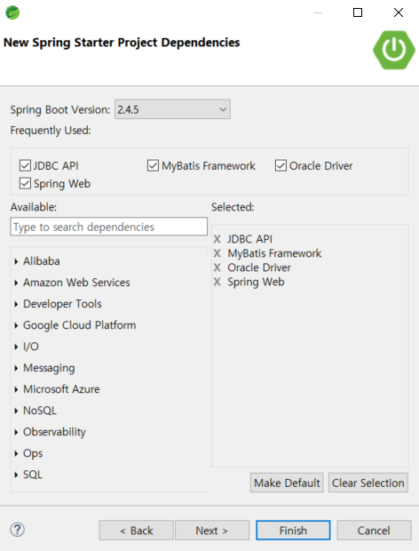
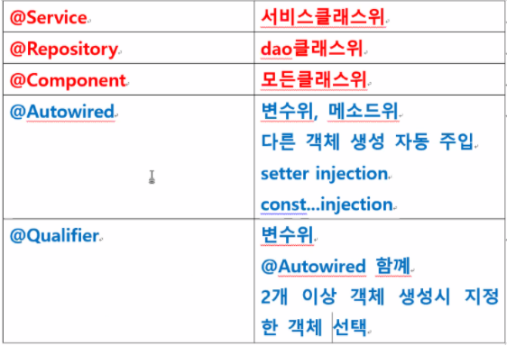

# Spring Boot

## 특징

Spring Boot는

톰캣이 기본적으로 내장되어있다

컨텍스트가 존재하지 않는다

<br>

## 초기세팅

Spring starter Project로 프로젝트 생성





<br>

pom.xml에 아래의 코드 추가

```xml
		<!-- for jsp -->
		<dependency>
        <groupId>org.apache.tomcat.embed</groupId>
        <artifactId>tomcat-embed-jasper</artifactId>
        <scope>provided</scope>
	    </dependency>
			<!-- for jsp jstl -->
	    <dependency>
	        <groupId>javax.servlet</groupId>
	        <artifactId>jstl</artifactId>
	    </dependency>
	    <!-- for tomcat restart -->
	    <!-- 컨트롤러와 jsp가 바뀔때마다 서버재시작 -->
		<dependency>
            <groupId>org.springframework.boot</groupId>
            <artifactId>spring-boot-devtools</artifactId>
            <optional>true</optional>
        </dependency>
```

<br>

src -> main -> resources -> application.properties 에 각종 설정값 세팅

```xml
#서버포트변경
server.port=9091

#view파일 경로설정
spring.mvc.view.prefix=/WEB-INF/views/
spring.mvc.view.suffix=.jsp

#file upload size (기본 1mb가 최대크기)
spring.servlet.multipart.maxFileSize=100MB
spring.servlet.multipart.maxRequestSize=100MB

#mybatis db 연결정보
spring.datasource.driverClassName = oracle.jdbc.OracleDriver
spring.datasource.url=jdbc:oracle:thin:@127.0.0.1:1521:xe
spring.datasource.username=hr
spring.datasource.password=hr

#mybatis 연결설정파일명
#classpath src/main/resources
mybatis.config-location=classpath:db-config.xml
```

<br>

Mybatis 매핑 설정파일 : src -> main -> resources -> mybatis(폴더생성) -> sql-mapping.xml (생성)

```xml
<?xml version="1.0" encoding="UTF-8" ?>
<!DOCTYPE mapper PUBLIC "-//mybatis.org//DTD Mapper 3.0//EN"
  "http://mybatis.org/dtd/mybatis-3-mapper.dtd">
<mapper namespace="spring_mybatis.EmpDAO"> 
<!-- 
	namespace에는 sql mapping용 DAO를 적어주자
	EmpDAO만 sql문 호출가능 
	EmpDAO에는 @Mapper 붙여줘야함
	EmpDAO의 함수와 mapping의 id값이 같아야한다
	EmpDAO는 interface처리를 해줘야함
-->
	<select id="getAllEmp" resultType="empVO">
		select * from employees
	</select>		
</mapper>
```

<br>

src -> main -> resources -> db-config.xml ( 생성 )

```xml
<?xml version="1.0" encoding="UTF-8" ?>
<!DOCTYPE configuration
  PUBLIC "-//mybatis.org//DTD Config 3.0//EN"
  "http://mybatis.org/dtd/mybatis-3-config.dtd">
  <!-- mybatis db 연결정보 세팅 파일 -->
<configuration>
	<!-- 1.타입 alias : 
	mybatis.EmpVO : SQL결과 데이터 저장 
	별명 : empVO 
	-->
	<typeAliases>
        <!-- EmpVO는 empVO로 표현하겠다 -->
        <typeAlias type="spring_mybatis.EmpVO" alias="empVO"/> 
	</typeAliases> 
		
	 <!-- sql mapping 파일 설정 --> 
	<mappers>
		<mapper resource = "mybatis/sql-mapping.xml"/>
	</mappers>
	
</configuration>
```

<br>

[프로젝트명]~ Application.java

```java
package com.multi.myboot01;

import org.mybatis.spring.annotation.MapperScan;
import org.springframework.boot.SpringApplication;
import org.springframework.boot.autoconfigure.SpringBootApplication;
import org.springframework.context.annotation.ComponentScan;

import spring_mybatis.EmpController;
import spring_mybatis.EmpDAO;

//부트 시작클래스를 알리는 어노테이션
@SpringBootApplication 
//spring_mybatis의 내용도 읽어들인다
@ComponentScan//(basePackageClasses = EmpController.class) 
@ComponentScan(basePackageClasses = EmpController.class)
@MapperScan(basePackageClasses = EmpDAO.class) // EmpDAO매퍼를 읽어온다
public class Myboot01Application {

	public static void main(String[] args) {
		// spring boot tomcat 내장 서버 자동 실행
		SpringApplication.run(Myboot01Application.class, args);
	}

}
```

<br>

## 어노테이션



## @SpringBootApplication

스프링부트의 시작을 알리는 어노테이션

스프링부트의 main문이라고 생각하자


## @ComponentScan

각종 컴포넌트를 스캔해오는 태그로 DAO나 Controller 및 설정파일을 읽어들인다