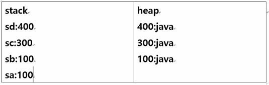

# 1주차

## Eclipse 환경설정

windows→ preferences → general → workspace → Other(UTF-8)로 바꿔주기

<br>


<br>

## 문자

알파벳 + 숫자 + 특수문자몇개 + 유럽 독자문자 + 아시아 각국 독자문자 = 2byte

문자하나를 2byte로 표현하는 이유는 각국의 다양한 언어를 유니코드로 표현하기 위함

<br>

## 숫자

boolean - 1byte(8bit)

`[1bit부호 - 0: 양 1:음][7bit]` - 1비트는 부호비트로 사용

표현가능 범위 : -2^7 ~ 2^7-1 (-128 ~ 127)

short - 2byte

`[1bit부호 - 0: 양 1:음][15bit]`

int - 4byte (가장많이 사용)

`[1bit부호 - 0: 양 1:음][31bit]`

long - 8byte (시간다룰때)

`[1bit부호 - 0: 양 1:음][63bit]`

<br>

## 메모리

String sa = "java"; 

String sb = "java"; 

String sc = new String("java"); 

String sd = new String("java");




sa와 sb는 같은 메모리주소를 공유한다 

new라는 키워드로 문자열을 생성하면

똑같은 문자열 내용이라도 각각 다른주소로 생성이된다

그래서 sc와 sd는 각자 다른 메모리주소에 할당된다

<br>

## modifier - 접근제한자


### this

1. 클래스내 멤버변수 접근
2. 클래스내 생성자 호출

### static

1. 객체가 생성되기전에 이미 메모리에 생성된다 - 프로그램 종료될때까지

### final

1. 수정불가하다 - 자원 공유가 안되게함

<br>

## 상속 - extends

1. is - a : 모든부분을 사용해야할 경우 extends로 상속

2. has - a

3. 클래스간에는 다중상속이 안된다 → 인터페이스로 해결

4. 상속을 할 경우 하위클래스에서 상위클래스의 생성자를 호출해줘야한다

   기본적으로 super(); 가 작성되어있다

<br>

## 메소드 Overloading

1개의 클래스에 같은 이름의 메소드를 여러개 정의하는 기술로 매개변수의 개수가 달라야한다

```java
public class Overloadingtest {

    // test() 호출
    void test(){
        System.out.println("매개변수 없음");
    }
   
    // test에 매개변수로 int형 2개 호출
    void test(int a, int b){
        System.out.println("매개변수 "+ a + "와 " + b);
    }
   
    // test에 매개변수 double형 1개 호출
    void test(double d){
        System.out.println("매개변수 " + d);
    }
}
```

```java
public class test {

    public static void main(String[] args) {
       
        // Overloadingtest 객체 생성
        Overloadingtest ob = new Overloadingtest();
       
        // test() 호출
        ob.test();
       
        // test(int a, int b) 호출
        ob.test(10, 20);
       
        // test(double d) 호출
        ob.test(50);
       
        // test(double d) 호출
        ob.test(123.4);
    }
}
```

<br>

## 메소드 Overiding

상위 클래스가 가지고 있는 멤버변수가 하위클래스로 상속되는 것처럼 상위 클래스가

가지고 있는 메소드도 하위 클래스로 상속되어 하위클래스에서 사용할 수 있다.

하지만, 하위 클래스에서 **메소드를 재정의**해서  사용하는 기술을 Overriding이라고 한다

```java
public class Employee{
   
    public String name;
    public int age;
   
    // print() 메소드
    public void print(){
        System.out.println("사원의 이름은 "+this.name+ "이고, 나이는" + this.age+"입니다.");
    }   
}


// Employee 상속
public class Manager extends Employee{
   
    String jobOfManage;
   
    // print() 메소드 오버라이딩
    public void print(){
        System.out.println("사원의 이름은 "+this.name + "이고, 나이는" + this.age + "입니다.");
        System.out.println("관리자 "+this.name+"은 "+this.jobOfManage+" 담당입니다.");
    }
}
```

<br>

## abstract

선언부만 있고 구현부는 없는 메소드나 클래스 앞에 쓴다

abstract는 상속과 overriding을 의무적으로 해야한다

객체생성이 불가능하다

<br>

## 상속관계

자동형변환 - 형변환연산자 생략가능

하위

class A{}

class B extends A{}

class C extends A{}

class D extneds C {}

class E{}

A a1 = new A(); → 형변환 필요x

A a2 = new B(); → 자동형변환

A a3 = new C(); → 자동형변환

A a4 = new D(); → 자동형변환

A a2 = new E(); → 자동형변환 오류

B b1 = new A(); → 자동형변환 오류

자동형변환 이후에 사용 가능한 변수와 메소드 (상위클래스의 변수와 메소드만 접근가능)

<br>

class A {i; ma()}

class B extends A {j; mb()}

A a2 = new B(); → 자동형변환

a2.i → o

a2.j → x (하위클래스의 변수 접근불가)

[a2.ma](http://a2.ma)() → o

a2.mb() → x

명시적형변환 - 형변환연산자 명시

자동형변환되었다가 다시 원래 하위타입 복원

class A {i; ma()}

class B extends A {j; mb()}

A a2 = new B(); → 자동형변환

B b2 =  (B)a2; → 명시적형변환

a2.i → o

b2.j → o

[a2.ma](http://a2.ma)() → o

b2.mb() → o

**변수는 형변환된 상위클래스걸로 사용하고 오버라이딩된 메소드는 하위클래스것을 사용함**

**단 명식적인 형변환을 하게되면 변수또한 하위클래스것을 사용할 수 있다**

<br>

## **형변환을 쓰는 이유 - 객체들 타입을 통일하기 위해 사용함**

1. 서로 다른 객체들을 1개 배열에 저장하여 사용할 경우

A ar[] = new A[5];

ar[0] = new A();

ar[1] = new B();

ar[2] = new C();

1. 아래와 같은경우 여러가지 객체를 사용해야할 경우 일일이 오버라이딩 해주는것보다

하나의 배열에서 형변환을 사용하는것이 좀 더 효율적이다

class Sample {

void test( A a1 ) { ... }

void test( B b1 ) { ... }

. . .

}

Sample s = new Sample();

s.test(new A());

s.test(new B());

s.test(new C());

<br>

## 인터페이스

1. 다중상속 가능
2. abstract 메소드만 가진다
3. 인터페이스 타입 객체 생성 불가능하다
4. 생성자 없다
5. public fiinal static 자동 선언 변수만 가진다
6. 인터페이스 overriding시 modifier반드시 붙여줄것(기본 public)
7. Source → Override/implement Method 클릭하면 자동으로 메소드생성

<br>

class A{}

class B{}

class C extends A{}

class D {} 추가

class B implements D{}

class C extends A implements D{}

1번 + 2번 = 인터페이스

2번 = abstract

1.다중상속 2.여러 서로 클래스 공통 메소드 정의 스펙 = abstract 클래스