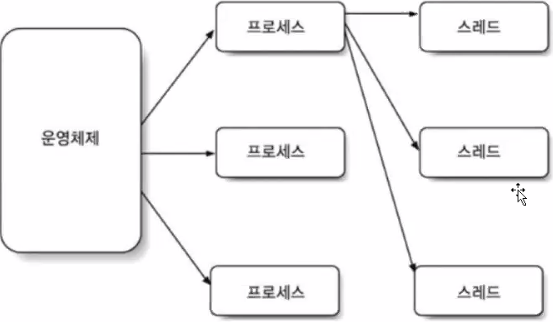

### String 생성자 오버로딩


<br>

##  String메소드

### length

String s = new String("java");

s.length(); —> 4문자 (문자 1개 2바이트 표현 - 8바이트)

(배열변수명.length —> String변수와는 다르게 괄호가없다)

<br>

### s.toUpperCase() / s.toLowerCase()

toUpperCase() --> 문자를 대문자로 바꿔준다

toLowerCase() --> 문자를 소문자로 바꿔준다

<br>

### replace

s.replace('a', 'b') —> String변수 s에 'a'문자를 'b'로 바꿔라

s.replace("ja", "ka") —> String변수 s에 "ja"문자를 "ka"로 바꿔라

<br>

### equals

String s1 = "java";

String s2 = new String("java");

String s3 = "JAVA";

s1 == s2 —> 주소값 - false

s1.equals(s2) —> 문자열값 - true

s1.equals(s3) —> 문자열값 - false

s1.equalgnoreCase(s3) —> 대소문자 구분없이 문자열값 비교 - true

<br>

### indexOf

String s = "program";

s.indexOf("ram"); —> 4 번인덱스부터 ram이 나오므로 4반환

s.indexOf("Lam"); —> 포함되지 않는 문자열은 -1을 반환한다

if(s.indexOf("Lam") ≥ 0) { // s문자열에서 Lam이라는 문자열이 포함하고있을때

}

<br>

### substring

String s = "program";

s.substring(4, 7); // 4번부터 7번까지의 문자열반환 --> ram

s.substring(4); // 4번 이후의 문자열 반환 --> ram

<br>

### 문자 정수 변환

문자 → 정수 변환 Integer.parseInt("100")

정수 → 문자 변환 String.valueOf(100)

<br>

### charAt

문자 하나를 찾을때

String s = "program";

s.charAt(0) —> 'p' // s문자열의 0번째 문자를 찾는다

<br>

### split

문자열 쪼개기

String s = "100-김사원-34500.5-사원-총무부";

String[] result = s.split("-"); // '-' 으로 문자열을 구분하여 배열에 저장

<br>

### format

문자열의 형식을 지정해줄 수 있다

String s = "program";

String.format("%10s", s); // 문자열 s의 앞에 10만큼 공간이 생긴다

String.format("%-10s", s); // 문자열 s의 뒤에 10만큼 공간이 생긴다

<br>

### StringBuilder / StringBuffer

문자열 생성 이후에 문자열 변경 추가 작업

StringBuffer sb = new StringBuffer("java");

sb.append("program");

<br>

### StringTokenizer

문자열을 토큰단위로 분리하여 읽을때 사용한다

<br>

## 정규표현식


```java
//정규표현식을 사용할때는 Pattern.matches 메소드를 이용한다
//1> 010- 시작 2> 국번 3-4자리 번호- 3> 전화번호 4자리 숫자
Pattern.matches("010-[0-9]{3,4}-[0-9]{4}", "010-1234-5678"); //true
Pattern.matches("010-[0-9]{3,4}-[0-9]{4}", "012-1234-5678"); //false
//왼쪽 정규표현식에 맞게 작성됐으면 true 아니면 false를 반환한다

//이메일인지 아닌지 정규표현식으로 구분해보자
String my_email = "javadosa1!@campus.com";
boolean result = Pattern.matches("[a-zA-Z0-9!#$%_]{8,10}@[a-zA-Z0-9]{3,10}\\.(com|co.kr|go.kr)", my_email); // true
if(result) System.out.println(my_email+" 은 이메일로 적합합니다");
```

<br>

## Calendar

날짜를 관리할 수 있다


Calendar는 new키워드로 생성하지 않고 Calendar.getInstance() 함수를 호출하여 생성해준다

```java
Calendar cal = Calendar.getInstance();
System.out.println(cal.getTime()); // 현재의 시간정보
System.out.println(cal.get(Calendar.YEAR)); // 년도 출력
System.out.println(cal.get(Calendar.MONTH)); // 달 출력
```

<br>

## SimpleDateFormat

데이터를 원하는 형식으로 변환할 수 있다

Date와 Calendar 둘다 현재 시간정보를 출력할 수 있다

```java
Date now = new Date();
Calendar cal = Calendar.getInstance();
SimpleDateFormat sdf = new SimpleDateFormat("yyyy-MM-dd E a hh:mm:ss");
//E - 컴퓨터 Locale 정보
String dat1 = sdf.format(now);
String dat2 = sdf.format(cal.getTime());
System.out.println(now); // Mon Mar 22 06:03:09 KST 2021
System.out.println(cal.getTime()); // Mon Mar 22 06:03:09 KST 2021
System.out.println(dat1); // 2021-03-22 월 오전 06:03:09
System.out.println(dat2); // 2021-03-22 월 오전 06:03:09
```

<br>

## 스레드(thread)

스레드란 프로세스를 구성하는 작업단위 이다



<br>

## 멀티스레드

멀티스레드를 구현하는 방법은 2가지가 있다

1. java.lang.Thread 클래스

2. java.lang.Runnable 인터페이스

1번과 2번 둘 다 run() 메소드를 오버라이딩 하여 사용한다

클래스가 이미 상속받은 상태인경우 Runnable인터페이스를 이용하자

<br>

## Thread클래스

```java
class Multi1 extends Thread{
	@Override
	public void run() {
		for(int i = 1; i<=10; i++) {
            //this.getName() - 현재 스레드의 이름반환
			System.out.println(this.getName()+":다른 작업 수행");
		}
	}
}
public class MultiThreadTest {
	public static void main(String[] args) {
		Multi1 m1 = new Multi1();
		m1.setName("m1"); // 스레드의 이름설정
		m1.start(); //run() 동시 실행 = m1
		
		Multi1 m2 = new Multi1();
		m2.setName("m2");
		m2.start(); //run() 동시 실행 = m2
		
		for(int i = 1; i<=10; i++) {
			System.out.println("메인 작업 수행"); // 메인 스레드
		}
	}
}
```

메인스레드와 멀티스레드1 멀티스레드2가 뒤섞여서 실행된다

<br>

## Runnable 인터페이스

Runnable은 이미 다른클래스를 상속받은상태일 경우 사용한다

```java
class Multi1 implements Runnable{
	@Override
	public void run() {
		for(int i = 1; i<=10; i++) {
			System.out.println(Thread.currentThread().getName()+":다른 작업 수행");
		}
	}
}
public class MultiThreadTest {
	public static void main(String[] args) {
		Multi1 m1 = new Multi1();
		Thread t1 = new Thread(m1);
		
		t1.setName("t1");
		t1.setPriority(Thread.MAX_PRIORITY); //스레드의 실행순서를 정할때 사용
		t1.start();
		
		Multi1 m2 = new Multi1();
		Thread t2 = new Thread(m2);
		
		t2.setName("t2");
		t1.setPriority(Thread.MIN_PRIORITY);
		t2.start();
		
		for(int i = 1; i<=10; i++) {
			System.out.println("메인 작업 수행");
		}
	}
}
```


<br>

## 컬렉션 프레임워크

배열 - 여러가지 데이터 저장구조

int i [] = new int[50];

- 기존 배열의 한계점

1> 동일 타입 데이터만 저장 구조 (형변환 가능하면 동일 타입 간주)

2> i = new int[100]; =⇒ 기존 50개 배열 주소 없어지고 100개 배열 주소 참조

배열 크기 정적

<br>

- 배열 한계점 개선 여러가지 데이터 저장 구조 클래스

1> 여러가지 타입 + 동일 타입

2> 크기 동적 변경 가능

3> 자바 틀 - 순서 / 값만 저장, 키와 값의 한쌍

<br>

기존 배열안에는 기본형변수(int[])와 참조형변수(String[])가 있다

단, 타입이 한가지로 고정이된다

컬렉션은 여러가지 타입이 저장 가능한데 참조형 데이터만 저장이 가능


set과 map은 기본적으로 데이터를 저장하는 순서가 **무작위**로 저장된다

<br>

### List

**ArrayList list = new ArrayList();**

⇒ 최초에 10개씩 객체 저장 ArrayList생성 모자라면 자동 10개씩 증가

ArrayList list = new ArrayList();

⇒ 최초에 5개씩 객체 저장 ArrayList생성 모자라면 자동 5개씩 증가

ArrayList list = new ArrayList(5, 3);

⇒ 최초에 5개씩 객체 저장 ArrayList생성 모자라면 자동 3개씩 증가

<br>

**List인터페이스**

**저장**

add(Object o) 정의 → ArrayList의 끝에 객체 추가

insertAt(Object o, int index) → ArrayList의 지정된 위치에 객체 추가

**수정 - list.set(1,"java") → 1번 위치에 있는 값을 java로 수정**

**삭제 - list.remove(1) → 1번 인덱스 삭제**

**조회 - 데이터갯수 조회 - list.size()**

**데이터 저장여부 조회 - list.contains("java") —> true / false 반환**

**데이터 저장위치 조회 - list.indexOf("java") —> java가 몇번째 위치에 있는지**

**특정 위치저장데이터 조회 - list.get(2) —> Object 반환**

<br>

### Set

HashSet<A> set = new HashSet<A>(); =⇒ 길이 동적 유지 / 동일 타입 데이터 저장 가능

**아래의 두 코드는 같은 동작을 하나 가급적 타입을 명시해주자**

HashSet<String> set = new HashSet<String>();

HashSet<String> set = new HashSet();

<br>

### Map

HashMap<String, Integer> map = new HashMap<String, Integer>();

HashMap<String> map = new HashMap();

map.put("id", 100); =⇒ "id"key 에 100 value값 입력

map.put("score", 100);

map.put("score", 200); =⇒ "score" key 값을 수정

map.get("id"); =⇒ "id" key의 value값을 조회

map.size() =⇒ map의 크기반환

<br>

## 제네릭 - Generics

1. 미리 사용 데이터 타입 알려준다
2. 컴파일러 타입 체크
3. 잘못된 형변환 실행시 줄어준다

ArrayList<A>

HashSet<B, D>

HashMap<C>


위의 코드에서는 매개변수의 타입이  지정돼있어 그 타입의 매개변수만 입력해줘야한다

하지만 제네릭을 사용하면 다양한 타입을 전달해줄 수 있어

보다 유연한 프로그래밍을 작성할 수 있다 -> 아래와같이 작성하자

```java
class Student<T> {
	T id;
	String name;
	int kor, eng, mat;
	public Student(T id, String name, int kor, int eng, int mat) {
	//	super(); -> 작성하지 않아도 기본적으로 동작한다
		this.id = id;
		this.name = name;
		this.kor = kor;
		this.eng = eng;
		this.mat = mat;
	}	
}

public class StudentMapTest {
	public static void main(String[] args) {
		Student<Integer> s1 = new Student<Integer>(100, "김자바", 50, 60, 70);
		Student<String> s2 = new Student<String>("200", "박지원", 50, 60, 70);		
		
		System.out.println(s1.equals(s2));
		
	}
}
```

<br>

## 익명클래스

딱 한번만 객체를 생성해서 사용해야할 경우 사용한다

<br>

## 람다식

변수나 메소드 정의 - 클래스 틀이 없을 수 도 있다.

람다 - 매개변수 선언 실행 문장 블록

람다는 무명의 메소드다

```java
class A {
	int add(int x, int y){
		return x + y;
	}
}
//위의 메소드를 아래와같이 변경가능
//람다식 (매개변수) -> {괄호식}
// 매개변수가 하나만있으면 소괄호 생략가능
// 매개변수가 없으면 빈괄호라도 써줘야함 () -> {}
// 한줄밖에 안되면 중괄호 생략가능 (x, y) -> return x + y;
(x, y)->{return x + y};
```

람다식으로 사용할 인터페이스를 정의할때 메소드를 하나만 사용하도록하자

why → 그래야 람다식으로 사용할때 메소드를 짐작할 수 있기때문

```java
@FunctionalInterface
interface Math{
	public int calc(int first, int second);	
}

public class FunctionalTest {
	public static void main(String[] args) {		
		// Math인터페이스에서 매개변수가 2개 있는 메소드를 오버라이딩하여 람다식 사용
		Math m = (a, b) -> a*b; 
		System.out.println(m.calc(10, 2)); // 20
				
	}
}
```

