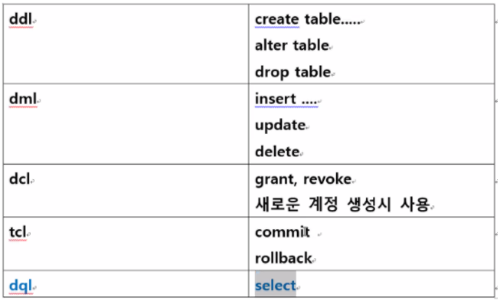
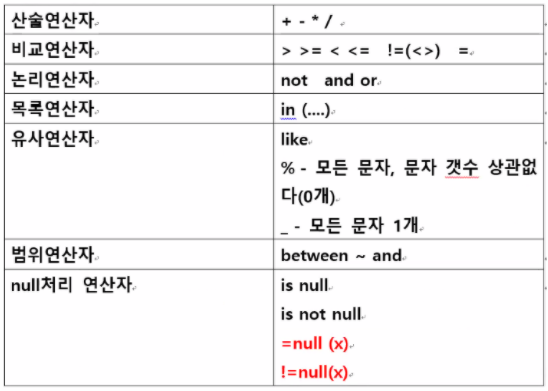
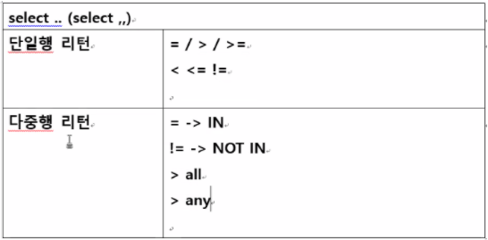
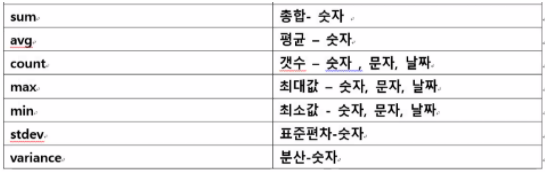

# 1주차

## 데이터베이스 표현방법

1. 계층형
2. 네트워크형
3. 관계형 데이터베이스 (oracle / mysql / ms sqlserver ...)

 

## Oracle 설치

[11g버전 다운로드](https://www.oracle.com/kr/database/technologies/oracle-database-software-downloads.html#license-lightbox)

데이터베이스

현재 18c 버전까지 나와있으나

11g버전이 무료로풀림

Express는 무료, 크기제한있고 1개만 사용가능

enterprise / standard edition 등은 유료로 사용가능

 

## Oracle 삭제

제어판 → Oracle Database 11g Express Edition제거

 

## SQL 종류

## SELECT 문법

여기서 설명하는 모든 예제는 오라클에서 기본제공하는 hr테이블을 사용한다

 

desc 테이블명; —> 테이블 컬럼명 타입 갯수

select 조회컬럼 from 테이블명;

 

> employees 테이블에서 first_name 열 조회

select first_name from employees;

select * from employees;

 

> 

 

### WHERE

조건문을 적용하여 검색하자

WHERE절에서  사용가능한 연산자

> employees테이블 급여 salary 10000이상인 사원의 이름과 급여 조회

select first_name, salary from employees where salary >= 10000;

 

> 급여 12배 = 연봉조회

select first_name, salary, salary * 12 from employees;

 

### AS

**실제 컬럼명을 원하는 이름으로 변경가능**

select first_name as 이름, salary as 월급, salary * 12 as 연봉 from employees;

 

### DISTINCT

**DISTINCT는 중복을 제거해준다**

select job_id from employees; ⇒ 107

select distinct job_id from employees;  ⇒ 19

 

### UPPER

**대문자로 변경**

select first_name, upper(first_name) as a from employees;

 

### IN

> **employee_id 컬럼 사번 50 100 150 200 250 300 인 사원 사번, 이름조회**

select employee_id, first_name 

from employees 

where employee_id=50 or employee_id = 100 or employee_id = 150 or employee_id = 200 or employee_id = 250 or employee_id = 300;

**위의 코드를 IN연산자를 사용해 조금 더 단순하게 바꿀 수 있다**

select employee_id, first_name from employees where employee_id in(50, 100, 150, 200, 250, 300);

 

### LIKE

> **이름이 J로 시작하는 사람을 찾아라**

select first_name from employees where first_name like 'J%';

 

> **이름이 r로 끝나는 사원 조회**

select first_name from employees where first_name like '%r';

 

> **employees 테이블에서 first_name에 er을 포함하는 사원 조회**

select first_name from employees where first_name like '%er%' ;

 

> **employees 테이블 job_id 컬럼에서 manager직종 조회**

('~_MAN' 으로 끝나면 manager직종이다)

**방법1**

select job_id from employees where job_id like '%MAN';

**방법2**

select job_id from employees where job_id like '___MAN';

 

> **employees 테이블 hire_date컬럼(입사일) 조회하되 입사년도가 05년 이후 조회**

select hire_date from employees where hire_date like '05%';

 

select hire_date from employees where hire_date >= '05/01/01' and hire_date <= '05/12/31';

**위의 연산을 between을 사용하여 조금 더 단순화시킬 수 있다.**

select hire_date from employees where hire_date between'05/01/01' and '05/12/31';

 

### SYSDATE

select sysdate from dual; —> 현재의 날짜정보를 알려준다

 

### ORDER BY

오름차순 / 내림차순 으로 정렬할때 사용한다

 

아래의 SELECT문은 임의로 정렬되어 나오는것을 볼 수 있다

select first_name from employees;

select employee_id from employees;

 

order by를 사용하여 정렬해주자

select first_name from employees order by first_name asc;

—> 알파벳 순서로 정렬 (오름차순)

select first_name from employees order by first_name desc;

—> 알파벳 역순서로 정렬 (내림차순)

 

select salary from employees order by salary asc;

—> 급여를 오름차순으로 정렬

select salary from employees order by salary desc;

—>급여를 내림차순으로 정렬

 

> **입사월이 6월 입사 사원 이름 급여 입사일 조회되도록 입사일이 가장 최근 사원부터 조회**

select first_name, salary, hire_date 

from employees 

where hire_date like '___06%' order by hire_date desc;

 

> **만약 입사일이 같다면 salary가 더 높은사람을 먼저 출력**

select first_name, salary, hire_date 

from employees 

where hire_date like '___06%' order by 3 desc, 2 desc; --> 3은 hire_date / 2는 salary

 

> **employees 테이블 commission_pct 컬럼조회**

select commission_pct from employees order by 1 asc; —> null 마지막

select commission_pct from employees order by 1 desc; —> null 처음

> **null을 제외하고 출력해보자**

select commission_pct from employees where commission_pct is not null;

 

### ROWNUM

ROWNUM은 각 행마다 번호를 생성해주는 함수이다  번호를 적절히 사용해보자

> **최근 입사자 5명만 조회**

select rownum, hire_date from employees where rownum <= 5 order by hire_date desc;

 

### 단일행 다중행

> **Susan과 같은 부서 사원의 부서코드, 이름 조회**

select department_id, first_name from employees

where department_id = (select department_id from employees where first_name='Susan');

 

> **Wiliam과 같은 부서 사원의 부서코드, 이름 조회**

select department_id, first_name from employees

where department_id IN (select department_id from employees where first_name='William');

==> 리턴값이 여러개일때는 IN 연산자를 사용하자

 

> **Susan과 급여가 같거나 더 많이 받는 사원의 부서코드, 이름 조회**

select department_id, first_name from employees

where department_id >= (select salary from employees where first_name='Susan');

 

> **William과 급여가 같거나 더 많이 받는 사원의 부서코드, 이름 조회**

select department_id, first_name from employees

where salary >= all (select salary from employees where first_name='William');

 

**ALL, ANY**

예) 리턴값 (6500, 1000, 3000)

1> 모든 William의 급여와 같거나 많을 때

==⇒ 6500보다 같거나 많을 때 ( >= all )

2> 1명의 William 급여와 같거나 많을 때

==⇒ 1000보다 같거나 많을 때 ( >= any )

 

### 그룹함수

count는 null값을 제외하고 카운팅한다

만약 null값도 포함해서 세고싶으면 count(*)을 사용하자

 

select max(first_name), min(first_name) from employees;

=⇒ 문자는 알파벳순서로 먼저나오는게 작고 뒤에나오는게 크다

select max(hire_date), min(hire_date) from employees;

=⇒ 날짜가 최근인게 크고 오래된게 작다

 

> **최대급여를 받는사람과 최소급여를 받는사람을 구하자**

select first_name, max(salary) from employees

where salary = (select max(salary) from employees)

or salary = (select min(salary) from employees)

 

> **부서별 급여총합**

select department_id, sum(salary)

from employees

group by department_id;

 

> **80번 부서의 급여총합**

select sum(salary)

from employees

where department_id=80

 

> **부서별 급여 총합 조회 - group by**

select department_id, sum(salary)

from employees

group by department_id;

**⇒그룹함수(SUM, AVG ...) 조회시 select절에 다른컬럼 조회불가**

**단 group함수에서 사용한 컬럼만 조회가능**

 

> **부서별 급여 총합 조회 (부서 배정 안된 사원(null) 제외)**

select department_id, sum(salary)

from employees

where department_id is not null;

group by department_id —> 부서ID를 기준으로 나눠진다

 

> **부서를 기준으로 나눠 거기서 직종으로 또나눠**

select department_id as 부서, job_id as 직종, sum(salary) as 부서직종별급여총합

from employees

where department_id is not null;

group by department_id, job_id

 

### HAVING

HAVING은 GROUP BY 절에서 사용가능한 WHERE문이다

> **부서별로 급여 총합 조회하되 부서별급여 총합이 10000미만인 부서만 조회**

select department_id, sum(salary)

from employees

group by department_id

having sum(salary) < 10000;

 

> **부서별로 급여 총합 조회하되 부서별급여 총합이 5000미만은 제외하고 부서별급여총합이 50000 이상인 부서의 결과만 조회**

select department_id, sum(salary)

from employees

where salary >= 5000

group by department_id

having sum(salary) >= 50000

 

### SQL 연습문제 - 1

> **1. 2002년 이후에 입사한 직원들 중에서 급여가 13000 이상 20000 이하인 직원들의 이름, 급여, 부서id, 입사일을 조회하시오.**

select first_name, salary, job_id from employees

where hire_date > '02/01/01' and salary between 13000 and 20000;

 

> **2. 근무한지 10년이 넘은 사원의 이름과 근무년수를 조회하시오.**

select first_name, sysdate - hire_date as '근무년수' 

from employees where sysdate - hire_date > = 365 *10 ;

 

> **3. 직원 중에서 상관이 없는 직원의 이름과 급여를 조회하시오. **
>
> **상관의 정보는 manager_id 컬럼에 있습니다.**

select first_name, salary from employees where manager_id is null;

 

> **4. 10, 50 번 부서에 속해있으면서 급여가 13000 이상인 직원의 이름, 급여, 부서id를 조회하시오.**

select first_name, salary, department_id from employees 

where department_id in(10, 50) and salary >= 13000;

 

> **5. 직종이 clerk 직종인 직원의 이름, 급여, 직종코드를 조회하시오. (clerk 직종은 job_id에 CLERK을 포함하거나 CLERK으로 끝난다.)**

select first_name, salary, job_id from employees where job_id like '%CLERK'

 

> **6. 12월에 입사한 직원의 이름, 급여, 입사일을 조회하시오.**

select first_name, salary, hire_date from employees where hire_date like '___12%'

 

> **7. 이름이 m으로 끝나는 직원의 이름, 급여, 입사일을 조회하시오.**

select first_name, salary, hire_date from employees where first_name like '%m'

 

> **8. 이름의 네번째 글자가 d인 이름, 급여, 입사일을 조회하시오.**

select first_name, salary, hire_date from employees where first_name like '___d%'

 

> **9. 커미션을 받는 직원의 이름, 커미션, 총급여를 조회하시오. 총급여는 커미션*급여로 계산합니다**

select first_name, commission_pct, commission_pct*salary as 총급여 

from employees where commission_pct is not null

 

> **10. 커미션을 받지 않는 직원의 이름, 급여를 조회하시오.**

select first_name, salary from employees where commission_pct is null

 

> 11. **10월에 입사해서 30, 50, 80 번 부서에 속해있으면서, 급여를 5000 이상 17000 이하를 받는 직원을 조회하시오. 단, 커미션을 받지 않는 직원들은 검색 대상에서 제외시키며, 먼저 입사한 직원이 먼저 출력되어야 하며 입사일이 같은 경우 급여가 많은 직원이 먼저 출력되록 하시오.**

SELECT first_name, salary, hire_date, department_id 

FROM employees 

WHERE department_id in (30, 50, 80) and hire_date LIKE '__/10/__' and 

salary between 5000 and 17000 and commission_pct is not null ORDER BY hire_date, salary desc;

 

> **12. jobs 테이블에서 회장과 부회장의 직종명, 최소급여,최대급여를 조회하시오. job_title은 직종명이고 회장은 president, 부회장은 vise president를 포함합니다.**

select min_salary, max_salary from jobs 

where job_title = 'President' or job_title = 'Administration Vice President';

 

> **13. countries 테이블에서 국가이름이 United Kingdom 인 국가의 국가코드를 조회하시오.**

select country_id from countries where country_name = 'United Kingdom';

 

> **14. 13번에서 조회한 결과를 이용하여 United Kingdom에 위치한 도시이름을 조회하시오.**

select country_name  from countries 

where country_id = (select country_id from countries where country_name = 'United Kingdom');

 

## 기타 꿀팁

edit - 직전에 입력한 SQL문을 수정할 수 있다

저장후 닫으면 명령어가 입력된다 → '/' 입력하면 실행

 

자바 → 문자열- " " / 문자1개 - ' '

오라클 → 문자타입 - ' '

오라클에서는 모든 문자를 입력할때 ' ' 안에 넣으면 된다

 

자바에서는 참조형변수만 null로 표현한다

오라클 모든 타입의 데이터 값이 없으면 null로 표현하고

오라클에서 null은 공백이다

따라서 Run SQL Command Line에서는 null데이터를 공백으로 표현한다

 

**SELECT문 실행순서**

1. from → 2.where(일반조건식) → 3.group by → 4.having(그룹함수조건식) → 5.select