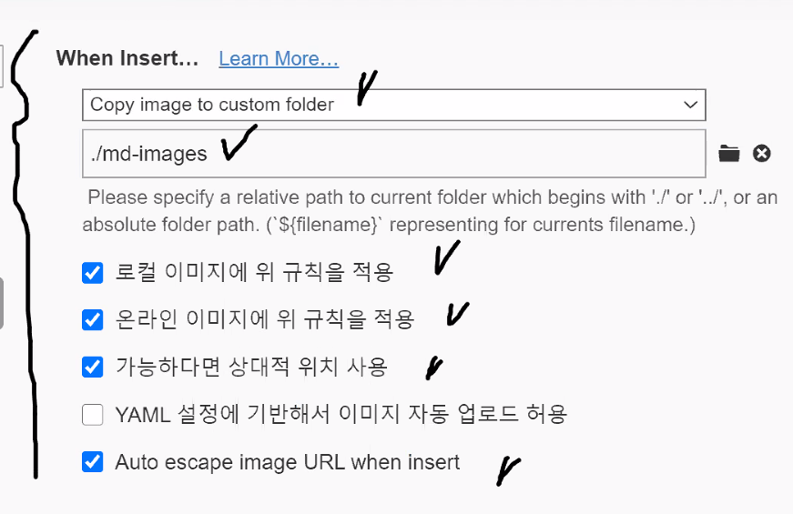

# 마크다운활용법


## 제목(heading)

제목은 #을 통해 레벨을 지정한다

### h3

### h4

### h5

### h6

## 목록

* 순서가 없는 목록
* 순서가 없어요
  * tab을 통해 하위 목록
* shift+tab으로 상위로

1. 순서가 있는 목록
2. 두번째 순서
   1. 하위 목록
3. 목록

## 코드블록

백틱(`) 3개 입력 후 원하는 코드를 써준다

// ex) ```java

```java
for(int i = 10; i<10; i++) {
    System.out.println("hello world!");
}
```

// 은 주석을 작성할 때 사용합니다.

## 링크

[]() 

대괄호[링크이름] 옆에 소괄호(url) 형식으로 작성

[구글](https://google.com)

## 표

| 순번 | 이름     | 비고 |
| ---- | -------- | ---- |
| 1    | 타이포라 |      |
| 2    | 표삽입   |      |
| 3    | 짱짱맨   |      |

## 이미지


이미지는 상대경로로 설정해주는것이 좋다

Why? --> github에 올렸을경우에도 이미지파일을 정상적으로

가져올 수 있다

환경설정 -> 이미지 -> 아래와 같이 설정




## 기타

*기울임(이탤릭)* --> 별한개 ( * )

**볼드체** --> 별두개 ( ** )

~~취소선~~  --> 물결 두개 ( ~~ )